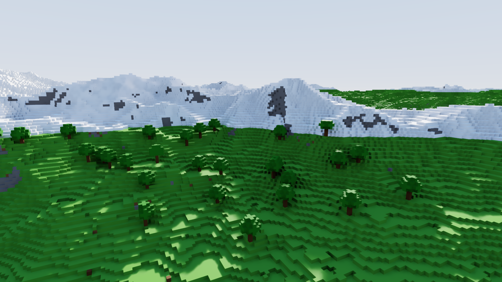

# Pyrit

A renderer for **sparse voxel DAGs**, written entirely in Zig — host library,
GPU kernels and tests alike. No graphics API: Pyrit runs on plain CUDA (NVIDIA,
RT cores through OptiX) and hands back CUDA buffers. The C header
`include/pyrit.h` only describes the ABI for other languages.



## What it does

- **Sparse voxel DAGs**, built on the GPU. No meshes, no vertices.
- **Large worlds**, streamed with **dynamic LOD**: no fixed levels — a chunk is
  refined based on how large one of its voxels is on screen. A memory budget
  slides that target up or down as needed.
- **Editable worlds**: `pyr_world_edit` sets or removes individual base voxels.
  Edits are an overlay on top of the generator, so they survive eviction and LOD
  changes, and they can be saved and restored as a buffer.
- **Ray tracing** on RT cores through a hand-written OptiX binding, with a
  software fallback path.
- **Global illumination**, shadows, reflections, transparency with refraction
  and tinted shadows, waves on water.
- **Per-pixel motion vectors** as a core goal — the basis for TAA, TAAU, frame
  generation and DLSS.
- **A complete output chain**: temporal accumulation, a variance-guided à-trous
  denoiser, TAAU (up to 4x), optional NVIDIA DLSS Super Resolution and Ray
  Reconstruction through NGX-CUDA, and frame generation in plain CUDA.
- **Skeletal animation on the GPU** with keyframe interpolation and wind sway.

## Building

Needs Zig 0.16. No GPU is required to build.

```sh
zig build                 # static + shared library, headers, PTX
zig build test            # unit, CPU and ABI tests, AMD compile check (no GPU)
zig build kernel-check    # verify PTX with ptxas (CUDA toolkit, no GPU)
zig build gpu-test        # GPU against the CPU reference (needs a free NVIDIA GPU)
zig build --release=fast  # optimised
```

The GPU kernels are compiled from the same Zig source for `nvptx64-cuda` (to
PTX) and for `amdgcn-amdhsa` (so far only as a compile check; a HIP backend is
to follow).

DLSS is optional and needs NVIDIA's SDK, which is not bundled (it has its own
licence). Clone it into `DLSS/` in the repository root — that path is
gitignored — and build with the SDK path:

```sh
git clone --depth 1 https://github.com/NVIDIA/DLSS.git
zig build -Ddlss-sdk=$PWD/DLSS
```

## Demo and tools

```sh
zig build demo   -- --size 1280x720
zig build demo   -- --record frames --still 10 --move 10 --reference 48
zig build render -- --world --size 1920x1080 --frames 30 --out image.ppm
```

`pyrit-demo` is a Minecraft-like world, generated on the GPU by its own CUDA
kernel written in Zig (`demo/terrain.zig`, `demo/kernels.zig`), with 1024 chunks
of view distance. Pyrit itself has no built-in terrain: the demo plugs its
generator in through `PyrWorldInfo.generate`, like any application would. The
sky is computed by single scattering in the atmosphere (`demo/sky.zig`).

The window uses **no graphics API at all**: Pyrit renders into a CUDA buffer,
the demo copies it into a shared-memory buffer and shows it over **Wayland**
(xdg-shell). `libwayland-client` is loaded dynamically and the xdg-shell tables
live in `demo/wayland.zig`. Controls (spectator mode): W/S fly along the view
direction, A/D strafe, space up, shift down, ctrl faster, mouse drag to look,
Q/E to roll the sun, +/− to change the target voxel size.

`--record` renders without a window: first frames to settle, then still frames,
then frames in flight, all written as PPM. `--reference N` additionally renders
a converged reference for every frame in flight and reports how far the moving
image deviates from it (with difference maps) — the measure for smearing,
lag and "wandering" shadows during motion.

`pyrit-render --world` renders the same world and measures: `--profile` breaks
the frame time down, `--flicker` measures temporal flicker, `--seq` writes every
frame, `--turn` rotates the camera along the test flight and `--view` sets the
view distance.

## Documentation

The documentation is in German.

- [`docs/API.md`](docs/API.md) — the API in detail
- [`pyrit-plan.md`](pyrit-plan.md) — structure, decisions and measurements

## License

Not decided yet.
