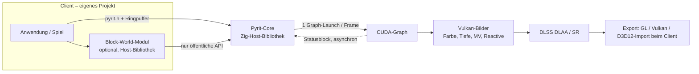
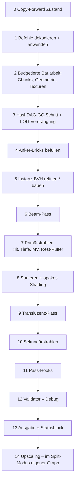

# Pyrit – Voxel-DAG-Renderer auf CUDA (Plan v2)

Stand: 21.09.2026 · Nachfolger von `voxel-dag-renderer-plan(1).md`

## v3 – Stand der Umsetzung (21.09.2026)

Mit dem Start der Umsetzung gelten folgende Entscheidungen. Wo die Abschnitte darunter (v2) widersprechen, gilt v3.

| Thema | v3 | Grund |
| --- | --- | --- |
| Grafik-API | **Reines CUDA, dauerhaft kein Vulkan.** Ausgaben sind CUDA-Gerätepuffer der Anwendung. | Vorgabe; einfachste und kontrollierbarste Schnittstelle |
| DLSS / Frame Generation | DLSS SR und Ray Reconstruction über **NGX-CUDA** (optional, `-Ddlss-sdk`); DLSS-FG braucht D3D12/Vulkan → **eigene CUDA-Frame-Generation** mit Hook; eigenes TAAU als Standard | NGX bietet CUDA-Einstieg; FG nicht |
| Sprache | **alles in Zig**: Host, GPU-Kernel, Tests, Build-Werkzeuge. `include/pyrit.h` beschreibt nur die C-ABI für andere Sprachen; `tests/abi_test.zig` prüft sie gegen die Zig-Typen | Vorgabe (kein C++) |
| Gerätecode | Zig-Modul `pyrit_device` (`src/device/`), übersetzt für **nvptx64-cuda** (PTX, JIT im Treiber) und **amdgcn-amdhsa**; derselbe Code läuft auf der CPU und ist dort testbar. Kein NVRTC mehr | ein Quelltext für CUDA und ROCm |
| Zig-0.16-Umgehungen | (1) Exporte erscheinen im LLVM-IR als Alias, NVPTX lehnt das ab → `tools/ptx_fixup.zig` benennt um, danach `zig cc` → PTX. (2) `@workGroupSize` in Rechnungen erzeugt auf amdgcn ungültiges Bitcode → feste Blockgrößen | Fehler in Zig 0.16; beide Umgehungen sind lokal und leicht entfernbar |
| Öffentliche API | einfache Funktionen (`pyr_instance_set_transform`, `pyr_commit`, `pyr_render`, `pyr_trace`); der Ringpuffer ist internes Detail | maximal einfache Syntax, volle Kontrolle über Puffer, Stream und Kontext |
| Raytracing | Kernfunktion: `pyr_trace` (Host, Batch) und `pyr.trace()` in eigenen Zig-Kerneln über das Modul `pyrit_device` + `pyr_scene_device()` | RT soll leicht möglich sein |
| Hooks | vorerst keine; eigene Kernel mit `pyr::trace` decken Materialien, Schatten, GI ab. Warp/UV-Fluss/Anker-Bricks folgen als Header-Erweiterungen | kleinerer Kern, gleiche Kontrolle |
| RT-Cores | **OptiX** (Teil des NVIDIA-Treibers, kein Vulkan): Hardware-BVH über AABBs der belegten Teilbäume (Standard 16³, `rt_leaf_log2`), IAS über alle Instanzen; Intersection- und Closest-Hit-Programme in Zig; CUDA-Traversierung bleibt als Rückfall (`PYR_CREATE_NO_RT`, GPUs ohne RT-Cores) und für `pyr.trace` in eigenen Kerneln | RT-Cores sind nur über OptiX (oder Grafik-APIs) erreichbar |
| ROCm/HIP | später; Kernel übersetzen bereits für gfx1100/gfx90a. Es fehlen HIP-Laufzeit (dynamisch geladen wie `src/cuda.zig`) und das Linken zu einem Code-Objekt | Vorgabe |

### Umgesetzt

- `include/pyrit.h` – C-ABI (32 Funktionen); `src/api.zig`, `src/device/types.zig` – dieselben Typen in Zig
- `src/device/` – DAG-Traversierung (gespiegelter Oktant, ESVO-artiger Aufstieg per höchstem geänderten Bit, 2 Ebenen im 64-Bit-Brick), Attribute (Dado-Rang), Szene über Instanzen, Kamera-Strahlen, Tiefe, Motion Vectors pro Pixel aus exakter Ruheposition, Flags `new` / `no_history` / `inside`
- `src/gpu_kernels.zig` – drei Kernel (Zustand, Render, Trace); PTX sm_75: 72–80 Register, keine Spills (ptxas für sm_120); amdgcn: 64–84 VGPRs
- `src/dag_builder.zig` – CPU-DAG-Bau (dicht, Punktliste, Funktion mit optionalem Leer-Test), strombasiert in Morton-Reihenfolge mit Deduplizierung
- `src/context.zig` – dynamisch geladene Treiber-API, Pools mit Bereichsverwaltung und verzögerter Freigabe, doppelt gepufferter Instanzzustand mit Copy-Forward, Ansichten mit Kamerahistorie, gepinnter Upload-Puffer
- RT-Pfad: `src/rt.zig` (OptiX-Kontext, Pipeline, SBT mit einer Hitgroup pro Geometrie, kompaktierte GAS pro Geometrie, IAS pro Frame), `src/rt_prims.zig` (AABB-Primitive mit knapper Hülle und Attributrang), `src/rt_kernels.zig` (OptiX-Programme), `src/device/optix.zig` (Intrinsics als Zig-Inline-Assembler), `src/optix.zig` (Host-Anbindung, ABI 118); IAS-Instanzen entstehen auf der GPU (`pyr_k_build_rt_instances`)
- Verzögerte Freigabe von Geometrien erst nach dem nächsten Commit (vorher konnte die GPU über den alten Zustand noch freigegebenen Speicher lesen)
- Tests (`zig build test`, ohne GPU): Unit-Tests, CPU-Tests gegen f64-Referenz-DDA, CPU-Emulation des RT-Pfads (0 Abweichungen zur vollen Traversierung), ABI-Test, AMD-Übersetzung; `zig build optix-abi-test -Doptix-include=…`: OptiX-Anbindung gegen die Original-Header; `zig build kernel-check`: ptxas; `zig build gpu-test`: GPU gegen CPU und Durchsatz – nur bei freier GPU

### Messungen (22.09.2026, RTX 5070 Laptop, 1920×1080, Primärstrahlen + Tiefe + Motion Vectors)

GPU-Ergebnisse stimmen mit der CPU-Referenz überein (CUDA: 100 %; RT: 99,99 %, Rest = Strahlen, die in einem Voxel beginnen, wo die Fläche undefiniert ist).

| Instanzen (128³) | CUDA | RT-Cores (2^7) | Standard (automatisch) |
| --- | --- | --- | --- |
| 3 | 0,83 ms | 1,31 ms | **0,79 ms** (CUDA) |
| 64 | 4,14 ms | 3,29 ms | **3,27 ms** (RT) |
| 1000 | 31,6 ms | 6,14 ms | **6,14 ms** (RT, 5,2× schneller) |

Folgerungen: Die RT-Cores gewinnen über die Instanzebene (IAS); innerhalb einer Geometrie ist die DAG-Traversierung im Shader schneller als eine feinere Hardware-BVH, daher Standard-Teilbaumgröße 2^7. Unter 16 Instanzen wird automatisch die CUDA-Traversierung genutzt (`PYR_CREATE_FORCE_RT` / `PYR_CREATE_NO_RT` erzwingen einen Pfad).

### Stand 22.09.2026 (Renderer-API)

Zusätzlich umgesetzt, alles auf der GPU und gegen CPU-Referenzen geprüft (33 CPU-Tests; GPU-Test bei freier GPU bestanden):

| Bereich | Umsetzung |
| --- | --- |
| Shading | Materialtabelle (256), Voxelfarbe im Attribut, Lambert + GGX, Emission, Sonne mit weichen Schatten, 16 Punktlichter, Himmel, 1 GI-Bounce oder AO, Reflexionsstrahlen; GPU = CPU (7169/7169 Pixel) |
| Transparenz | transparente Ebene per Instanzmaske: Fresnel, Deckkraft, Absorption (ohne Brechung) |
| Nachbearbeitung | temporale Akkumulation/TAA über die Motion Vectors mit Varianzbegrenzung, À-trous-Denoiser auf demodulierter Beleuchtung, Tonemapping (ACES/Reinhard) zu HDR/RGBA8, Halton-Jitter |
| DAG-Bau auf der GPU | Radix-Sort, Deduplizierung per GPU-Hashtabelle, Knotenebenen, RT-Primitive; Ergebnis identisch zum CPU-Builder; 312 000 Voxel in 4,5 ms |
| Änderungen | `pyr_geometry_edit` (setzen/entfernen) auf der GPU, 90 000 Einträge in 3,7 ms |
| LOD | `pyr_geometry_downsample` auf der GPU |
| Picking | `PYR_TRACE_EXTENDED`: Voxel, Position, Normale |
| RT-Cores | automatische Wahl (mit Shading immer RT), IAS-Refit bei reinen Bewegungen |
| E/A | MagicaVoxel-Import, DAG speichern/laden, Geometrie herunterladen |
| Werkzeuge | `zig build render` (Bild), `tools/gpu_free.sh` (GPU-Test nur bei freier GPU), Handbuch `docs/API.md` |

Volle Pipeline 1080p (Primärstrahl, Sonne + Punktlicht mit Schatten, GI, TAA, Denoiser, Tonemapping): 3 Instanzen 9,6 ms (RT) gegen 16,6 ms (CUDA); 1000 Instanzen 32 ms (RT) gegen 197 ms (CUDA).

### Stand 22.09.2026 (Welten, Ausgabe, Transparenz, Animation)

| Bereich | Umsetzung | Messung (RTX 5070 Laptop) |
| --- | --- | --- |
| Große Welten | `src/world_plan.zig` (Chunk-Octree, LOD nach Entfernung, lückenlose Übergänge, Verdrängung), `src/world.zig` (Arbeiter-Thread + eigener CUDA-Stream, stream-geordneter Speicher), Geländegenerator auf der GPU (nur Oberflächenhaut in LOD-Auflösung), Chunk-Batch-Bau mit gemeinsamen Pool-Bereichen, GAS ohne Synchronisation, eigener Generator per Hook | 1063 Chunks in 114 ms, Update 0,3 ms/Frame, ~11 MiB; Gelände wasserdicht (0 Löcher, Höhenfehler ≤ ½ Voxel) auf RT und CUDA |
| Hochskalieren | TAAU (`src/device/upscale.zig`) | 540p → 1080p 5,3 ms statt 16,8 ms nativ |
| DLSS | `src/dlss.zig`: NGX-CUDA, Eingaben als Texturobjekte über CUDA-Arrays, Ausgang als Surface | SR 8,9 ms, RR 12,0 ms (540p → 1080p) |
| Frame Generation | eigene CUDA-FG (Fixpunkt-Rückwärtssuche über exakte MVs) + Hook | 0,8 ms je 1080p-Zwischenbild |
| Transparenz | bis 4 Körper je Pixel, Brechung nach Snell, Austritt über `dag.traceExit`, Fresnel an Ein- und Austritt, Absorption | Snell exakt (CPU-Test) |
| Animation | Skelette aus Voxel-Teilen, Keyframe-Clips (Slerp, Überblenden), GPU-Kernel schreibt Instanzen bei `pyr_commit` | 2000 Akteure × 3 Teile: GPU = CPU (1,2e-4), 0,09 ms je Commit inkl. IAS-Refit |

### Stand 22.09.2026 (dynamisches LOD, Speicher, Leistung)

| Thema | Umsetzung | Wirkung |
| --- | --- | --- |
| Dynamisches LOD | keine festen Stufen mehr: verfeinert wird nach der Größe eines Voxels auf dem Bildschirm (`voxel_pixels`, aus Kameraauflösung und Blickwinkel), Tiefe aus `view_distance`; Speicherbudget und freie Geometrieplätze regeln die Zielgröße gleitend nach | Planer-Test hält das Ziel exakt ein (größtes sichtbares Voxel 4,00 px bei Ziel 4); 8 px: 2331 Chunks/22 MiB, 4 px: 7142 Chunks/64 MiB |
| Zwischenspeicher des Baus | Schranken je Ebene statt je Voxel, tatsächliche Brickzahl einmal zurückgelesen, Hash-Auslastung 0,8 | 242 → 111 Byte je Voxel, Bau 3,5 → 3,2 ms |
| Nachbearbeitung | interne Puffer (Verlauf, Filter, TAAU) halbgenau | 3,25 → 2,86 ms, Ansicht in 1080p ~180 statt ~330 MiB |
| Sekundärstrahlen | `PyrTargets.secondary_mask`: Schatten, GI und Reflexionen sehen eine gröbere Fassung der Welt (Vorfahren-Chunks, schon im Speicher) samt entfernungsabhängigem Bias | ~10 % Renderzeit |
| GI-Reichweite | `PyrLighting.gi_distance` begrenzt die indirekten Strahlen | 64 Voxel: −21 % Renderzeit bei ~1 % Bildunterschied |
| Instanzmasken | Maskenwechsel lösen nur noch ein IAS-Refit aus, keinen Neubau | wichtig bei tausenden Chunks je Frame |

### Stand 22.09.2026 (Teil 3: Leistung, Wasser, Transparenz)

| Thema | Umsetzung | Wirkung |
| --- | --- | --- |
| GI in halber Auflösung | `PYR_LIGHTING_GI_HALF`: ein Strahl je 2x2-Block (wandernder Abtastpunkt), eigener Durchgang (CUDA-Kernel bzw. OptiX-Raygen), kantenbewusstes Hochskalieren über Normale und Tiefe | Rendern 10,4 → 5,5 ms; Mittelwert im CPU-Test 0,1 % neben voller Auflösung |
| Material-Transparenz | `PYR_MATERIAL_TRANSPARENT` + `PYR_TRACE_SKIP_TRANSPARENT`: die Traversierung überspringt durchsichtige Voxel (Bitmaske der Materialien in der Szene), Schattenstrahlen werden getönt statt blockiert | Wasser liegt in derselben Chunk-Geometrie wie der Boden, keine zusätzlichen Instanzen |
| Wasser und Vegetation | Geländegenerator erzeugt Wasserfläche bis `sea_level` und Bäume; Oktaven des Rauschens gegeneinander gedreht | Küsten mit Tiefenfärbung, Brechung und Wellen |
| Wellen | `PYR_MATERIAL_WAVES`: zeitabhängige Normalenstörung ohne Geometrieänderung | bewegtes Wasser bei exakten Motion Vectors |
| DLSS Ray Reconstruction | Ziel `material` (Rauheit, Metall) speist echte Rauheits- und Spiegel-Albedo-Puffer | sichtbar schärferes Bild |
| Frame Generation | Vorwärtsprojektion der Bewegungsvektoren mit Tiefentest (atomares Minimum), Fixpunktsuche nur noch als Rückfall | korrekte Verdeckung an Silhouetten |
| Sortierung im Bau | 128 statt 256 Elemente je Thread (gemessen bester Kompromiss) | Bau 3,3 → 2,7 ms, +4 Byte je Voxel |
| Skelette/Clips | `pyr_skeleton_destroy`, `pyr_clip_destroy` | Ressourcen wieder freigebbar |

### Nächste Schritte

1. GI in halber Auflösung mit kantenbewusstem Hochskalieren (der Bounce ist die Hälfte der Renderzeit)
2. Onesweep-Sort im GPU-Bau (decoupled look-back); die einfache Blockgrößen-Anpassung hat schon 18 % gebracht, der Rest ist Feinarbeit mit Speichermodell-Risiko
3. DLSS-RR: Jitter- und Matrixkonventionen gegen eine NVIDIA-Referenz prüfen
4. Echte weiche Verformung (Voxelverschiebung statt Normalenstörung)
5. HIP-Backend (Code-Objekt aus dem amdgcn-Build, libamdhip64 dynamisch)

## Ziel und Rahmen

Pyrit ist eine eigenständige Render-Runtime. Mit wenig Code soll sie hocheffizient sein, und exakte Motion Vectors entstehen automatisch – **pro Pixel**, auch innerhalb einer Voxelzelle und auch für bewegte, verformte und texturanimierte Oberflächen. Geometrie besteht zur Laufzeit ausschließlich aus Sparse Voxel DAGs, ohne Vertices oder Meshes.

Festgelegte Rahmenbedingungen:

- **Vollständig GPU-getrieben:** Pro Frame schreibt der Client nur Befehle in einen Ringpuffer und startet einen einzigen CUDA-Graphen. Es gibt keine synchronen Rückleseoperationen und keine Entscheidungen auf dem Host. Rückmeldungen laufen asynchron über einen Statusblock.
- **Zig** für Host-Bibliothek und alle Kernel ohne Hooks; **generiertes CUDA C++** für die Kernel, die Hooks aufrufen (siehe *Toolchain*).
- **Reine C-ABI** (`include/pyrit.h`). Clients in C, C++, Zig, Rust oder Java (FFM) sprechen die Runtime über dieselbe Schnittstelle an.
- **Clients sind eigene Projekte.** Integrationen in bestehende Spiele (z. B. Minecraft) nutzen ausschließlich die öffentliche API und sind nicht Teil dieses Plans. Referenz-Client ist ein eigener, kleiner Viewer.
- **Erweiterbarkeit:** Eigener CUDA-Code kommt über Hooks für Materialien, Verformungen, Voxel-Animationen, Texturfluss, Geometriequellen und eigene Passes hinein. Die Runtime nutzt diese Hooks auch für ihre eigenen Effekte.

API-Entwurf zu diesem Plan:

| Datei | Inhalt |
| --- | --- |
| `include/pyrit.h` | Host-API: Lebenszyklus, Exporte, Frames, Status, Wiederherstellung, Hooks, Pipeline |
| `include/pyrit_ring.h` | Befehlsformat des Ringpuffers und inline-Schreibhilfe |
| `include/pyrit_hooks.h` | Hook-ABI auf dem Gerät: Zustand, Kontext, Oberfläche, Hilfsfunktionen |
| `examples/hooks_example.cu` | Beispiel-Hooks (Warp, Texturfluss, Material) |

Alle drei Header kompilieren (C11, C++17, nvcc `-rdc`), und die Größen der Records sind mit statischen Assertions abgesichert.

## Änderungen gegenüber v1

| # | Änderung | Grund |
| --- | --- | --- |
| 1 | Zustand: Copy-Forward der zuletzt geänderten Slots zu Beginn jedes Frames | Mit Paritäts-Flip und reinen Deltas enthielten unveränderte Slots den Stand von vor zwei Frames. Dadurch wären die MVs falsch. |
| 2 | Hook-Parameter liegen in einer doppelt gepufferten Param-Arena | Geänderte Parameter hätten sonst den Vorframe-Aufruf verfälscht. |
| 3 | Slots und alle Handles tragen eine Generation | Ein wiederverwendeter Slot hätte sonst die Vorgeschichte des alten Objekts geerbt. |
| 4 | Zeit als `double`, Zugriff in Hooks über `pyr_time_phase()` | Bei `float time` beträgt die Auflösung nach einem Tag etwa 8 ms. Die Folge wären Ruckeln und verrauschte MVs. |
| 5 | Render-Ursprung (`origin`, double) im Frame-Zustand | Floats bleiben auch in großen Welten nahe der Kamera genau, und der Ursprung darf wandern, ohne die MVs zu stören. |
| 6 | Ringpuffer-Format als versionierter Vertrag mit festen 64-Byte-Records | Die GPU dekodiert parallel. Das Format ist das eigentliche API. |
| 7 | Blobs über mehrere Frames, Staging-Queue auf der GPU, Budgets, Backpressure | Große Uploads (Teleport, Nachladen) sprengten sonst das Segment oder das Frame-Budget. |
| 8 | Asynchroner Statusblock statt „keinerlei Rückfluss“ | Poolfüllstände, Fehler und Validator-Werte müssen den Host erreichen, ohne zu blockieren. |
| 9 | Fehlercodes, ABI-Version, `pyr_resize`, `pyr_destroy`, `pyr_recover` | Diese Teile fehlten in der Host-API. |
| 10 | Handles vergibt der Client | Die Runtime muss nie IDs zurückliefern, das Einwegprinzip bleibt erhalten. |
| 11 | `PyrHookCtx` in allen Hooks (Slot, Generation, Zelle, Seed, user_id) | Regel 2 (Zufall aus stabiler ID) war mit den alten Signaturen nicht erfüllbar. |
| 12 | Material-Hook liefert `PyrSurface` (Albedo, Normale, Rauheit, Emission …) | Mit fertiger Farbe wären Schatten, GI und Reflexionen nicht möglich gewesen. |
| 13 | UV-Fluss mit deklarierter Periode (`uv_period`) | Ungewickelte UVs verlieren Genauigkeit, gewickelte springen. Die Runtime rechnet deshalb modulo Periode. |
| 14 | Generierte Traversierung in CUDA C++ ist der **Hauptpfad** | Indirekte Aufrufe im PTX-ABI kosten Register und Occupancy. LTOIR ist aus Zig nicht realistisch erreichbar. |
| 15 | Statische PTX-Prüfung jedes Hooks | Die Reinheitsregeln werden jetzt teilweise erzwungen statt nur dokumentiert. |
| 16 | Wiederherstellung nach Gerätefehler, Breadcrumbs, Hook-Quarantäne | Ein fehlerhafter fremder Hook machte bisher den CUDA-Kontext dauerhaft unbrauchbar. |
| 17 | MV-Validator auf Basis von Ruhepositionen statt Bilddifferenz | Er ist unabhängig von der Beleuchtung und exakt. Disocclusion ist als ID-Wechsel erkennbar. |
| 18 | HashDAG-GC und LOD-Cache mit Verdrängung | Ohne sie wächst der Speicher unbegrenzt. |
| 19 | Trennung in Core und Block-World-Modul; Minecraft ist ein externer Client | Nur so bleibt die API allgemein. |
| 20 | Hook-ABI v0 ab M1, eigene Effekte als Hooks gebaut | Die API ist erprobt, bevor sie in M7 als 1.0 eingefroren wird. |
| 21 | Split-Upscale-Modus | Clients können eigene Rastergeometrie vor DLSS einzeichnen. |

## Architekturüberblick



**Pyrit-Core** umfasst den DAG-Speicher, Geometrien, Instanzen und BVH, Gitter-Welten, Zustand und Slots, Hooks, den Frame-Graphen, die Ausgabe und das Interop. Der Core weiß nichts von Blöcken, Atlanten oder Spielen.

**Block-World-Modul** ist eine Host-Bibliothek plus ein Material-Hook auf Basis der öffentlichen API. Sie bietet:

- Blockmodelle aus Quader-Elementen (mit Rotation und Flächentexturen) → voxelisierte Modell-Geometrie,
- Zelltypen,
- Texturierung aus einem Atlas per Punkt-in-Quader-Test,
- Tönungsgitter und Flussrichtungen als Aux-Kanäle der Chunks.

Dass das Modul nur gegen `pyrit.h` linkt, prüft der Build. Damit ist es zugleich der Beweis, dass die API genügt.

**Interop:** Die Runtime besitzt ein eigenes Vulkan-Device. Sie legt die Ausgabebilder und binären Semaphoren an und exportiert sie (`pyr_get_exports`). CUDA importiert dieselben Objekte über External Memory und External Semaphores. Der Client importiert sie in seine API:

- OpenGL über `GL_EXT_memory_object` und `GL_EXT_semaphore`,
- Vulkan über `VK_KHR_external_memory` und `VK_KHR_external_semaphore`,
- D3D12 über Shared Handles.

`device_uuid` stellt sicher, dass beide Seiten dasselbe physische Gerät verwenden.

## Host-API

Überblick; die vollständigen Deklarationen stehen in `include/pyrit.h`.

| Aufruf | Häufigkeit | Zweck |
| --- | --- | --- |
| `pyr_create(config, &rt)` | einmal | Gerät, Pools, Ringpuffer und Graph anlegen; prüft `api_version` und `struct_size` |
| `pyr_get_exports(rt, &ex)` | nach create, resize und recover | Bilder und Semaphoren als externe Handles; `generation` zeigt einen nötigen Neuimport an |
| `pyr_state_declare_field(...)` | beim Start / zwischen Commits | eigene, doppelt gepufferte Slot-Felder |
| `pyr_hook_register(desc, &id, &log)` | beim Laden von Erweiterungen | Hook einzeln übersetzen und statisch prüfen |
| `pyr_buffer_declare(...)` | beim Start | zusätzliche Puffer für Pass-Hooks |
| `pyr_pipeline_commit` / `_poll` | nach Hook-Änderungen | Kernel generieren, übersetzen und linken, im Hintergrund; Wechsel beim nächsten Submit |
| `pyr_acquire(rt, timeout, &seg)` | pro Frame | nächstes Ring-Segment; wartet nur, wenn die GPU `ring_segments` Frames zurückliegt |
| `pyr_submit(rt, records, payload_top, flags)` | pro Frame | Graph starten |
| `pyr_upscale(rt)` | pro Frame, nur im Split-Modus | zweiter Graph: Upscaling + Ausgabe |
| `pyr_get_status(rt, &st)` | beliebig | letzter vollständiger Statusblock, blockiert nie |
| `pyr_resize(...)` | bei Größenänderung | Bilder und DLSS neu anlegen, Weltinhalt bleibt |
| `pyr_recover(rt)` | nach `PYR_ERR_DEVICE_LOST` | neuer Kontext, verdächtige Hooks in Quarantäne |
| `pyr_destroy(rt)` | einmal | alles freigeben |

**Fehlermodell:** Jede Funktion außer den reinen Abfragen liefert `PyrResult`. Fehler, die erst auf der GPU auftreten, kommen asynchron:

- Ungültige Befehle, volle Pools und Validator-Treffer erscheinen als Flags im Statusblock.
- Ein Kontextverlust erscheint als `PYR_ERR_DEVICE_LOST` beim nächsten `pyr_acquire` oder `pyr_submit`.

**Handles:** Der Client vergibt alle Handles (`PyrRef = {index, generation}`) innerhalb der Kapazitäten aus `PyrConfig.caps`. Ausnahme sind Hook-IDs, weil die Registrierung ohnehin synchron auf dem Host läuft. Die Generation muss bei jeder Wiederverwendung eines Index steigen.

**Threads:** Die Frame-Schleife ist einfädig. Hook-Registrierung und Pipeline-Bau dürfen aus einem Hintergrund-Thread kommen, damit das Übersetzen mit NVRTC nie einen Frame blockiert.

## Ringpuffer

Der Ringpuffer ist der eigentliche Datenvertrag (`include/pyrit_ring.h`). Er besteht aus `ring_segments` (Standard 3) Segmenten in gepinntem, write-combined Host-Speicher. Die GPU liest ihn direkt über den Bus.

```
0                                                                       C
| PyrCmd[0] | PyrCmd[1] | ... | PyrCmd[n-1] |   frei   |  Payloads ...   |
  Records wachsen von vorn (je 64 Byte), Payloads von hinten (16-Byte-aligned)
```

- **Feste Records** (16 Byte Kopf + 48 Byte Argumente): Ein Thread dekodiert einen Record. Batch-Befehle (`SLOT_TRANSFORMS`, `GRID_CELL_EDITS`, …) tragen Arrays im Payload, die danach per Prefix-Scan auf Threads verteilt werden. Variable Längen müsste die GPU dagegen seriell ablaufen.
- **Reihenfolge nach Befehlsklasse:** Die Klassen werden pro Frame in fester Reihenfolge angewendet: Frame → Upload → Slot-Belegung → Ressourcen → Zustand → Instanzen → Gitter. Die Position im Segment ist egal.
- **Eindeutigkeit:** Pro Frame gibt es höchstens einen Befehl je (Art, Ziel); das gilt auch innerhalb von Batches. Das vermeidet Schreibkonflikte ohne Sortierung. `PYR_CONFIG_DEBUG_RING` prüft das.
- **`PYR_CMD_FRAME`** kommt genau einmal pro Frame vor und enthält Zeit (double), `dt`, Render-Ursprung (double) und Kamera mit Jitter.
- **Blobs:** Große Daten werden als `BLOB_BEGIN` und danach beliebig viele `BLOB_DATA` über mehrere Frames übertragen. Die GPU kopiert jeden Teil sofort in die Staging-Queue, danach ist das Segment wieder frei. Ein Blob wird von genau einem Befehl verbraucht (`GEOMETRY_BUILD`, `TEXTURE_UPLOAD`, `GRID_CHUNK_LOAD` …) und dann freigegeben.
- **Volles Segment:** `pyr_writer_push` liefert `NULL`. Der Client schiebt den Rest in den nächsten Frame.
- **Backpressure:** Ist die Staging-Queue fast voll, setzt die Runtime `PYR_STATUS_BACKPRESSURE`. Der Client drosselt dann seine Uploads. Bauarbeit (Chunk-DAGs, Geometrie, GC) läuft budgetiert (`PyrBudgets`); der Rest wartet auf der GPU.
- **Versionierung:** Das Format hat Major und Minor. Neue Befehlsarten erhöhen Minor, geänderte Layouts erhöhen Major. Reservierte Felder müssen 0 sein, damit sie später nutzbar sind.

## Statusblock: der asynchrone Rückkanal

Am Ende jedes Graphen schreibt die GPU einen `PyrStatus` in gemappten Host-Speicher. `pyr_get_status` kopiert den letzten vollständigen Stand, der 1–3 Frames alt ist. Enthalten sind:

- abgeschlossener Frame,
- Füllstände aller Pools (DAG, Bricks, LOD-Cache, Staging, Param-Arena),
- wartende Bauaufträge,
- Flags: Backpressure, Pool erschöpft, ungültiger Befehl mit Frame und Record-Index, Validator-Fehler, Hook deaktiviert, LOD-Verdrängung,
- verdächtige Hooks,
- Validator-Kennzahlen,
- GPU-Zeit pro Pass (über `%globaltimer` in den Graph-Knoten).

Damit bleibt das Prinzip „keine Entscheidungen auf dem Host im Frame“ erhalten: Nichts wartet auf diese Daten. Der Client reagiert nur mit Verzögerung, etwa indem er drosselt oder Sichtweite reduziert.

## Grundprinzip der Motion Vectors

Alles, was sich bewegt, ist eine reine Funktion von explizit deklariertem Zustand. Der Zustand liegt auf der GPU doppelt vor, als aktueller und als Vorframe-Stand. Welche Hälfte die aktuelle ist, bestimmt die Parität des Frame-Zählers. Die Runtime ruft dieselbe Funktion ein zweites Mal mit dem Vorframe-Zustand auf:

```
MV = proj(f(p, ctx, s_prev), cam_prev) − proj(f(p, ctx, s_cur), cam_cur)
```

`ctx` ist die Identität des Treffers (Slot, Generation, Zelle, Seed) und in beiden Aufrufen gleich.

Drei harte Regeln:

1. Positionen und Texturkoordinaten hängen nur von deklariertem Zustand, Kontext und Ruheposition ab.
2. Zufall nur über `pyr_rand(ctx, salt)`, also aus stabiler ID plus Zustand.
3. Jeder sichtbare Punkt kann jederzeit sagen, woher er kommt: seine Ruheposition in einem stabilen Bezugssystem.

### Was zum Zustand gehört

| Teil | Inhalt | Pufferung |
| --- | --- | --- |
| Frame | Zeit (double), `dt`, Render-Ursprung (double), Kamera | jeden Frame vollständig geschrieben |
| Slots | Transformation (+ Inverse), Generation, Flags | Copy-Forward + Deltas |
| Slot-Daten | eigene Felder aus `pyr_state_declare_field` | Copy-Forward + Deltas |
| Param-Arena | Parameterblöcke aller Hooks, vom Client adressiert | Copy-Forward + Deltas |
| Texturanimation | Frame-Indizes, als Slot-Daten oder Parameter | wie oben |

### Doppelpuffer mit Copy-Forward

Invariante: **Am Ende von Frame N−1 unterscheiden sich die beiden Hälften nur in den Einträgen, die in Frame N−1 geändert wurden.** Ablauf zu Beginn von Frame N:

1. Die Einträge aus der Dirty-Liste von N−1 werden aus der Vorframe-Hälfte in die neue aktuelle Hälfte kopiert. Danach sind beide Hälften gleich.
2. Die Deltas aus dem Ring werden in die aktuelle Hälfte geschrieben; die geänderten Einträge bilden die Dirty-Liste von N.
3. Die Parität kippt.

Die Kosten wachsen mit der Anzahl der Änderungen, nicht mit der Anzahl der Slots. Für die Param-Arena gilt dasselbe mit Dirty-Bereichen.

### Stabile Slots mit Generation

Der Client vergibt jedem bewegten Objekt einen Slot, der über seine Lebensdauer gleich bleibt. `SLOT_ALLOC` erhöht die Generation. Weicht die aktuelle Generation eines Slots von der des Vorframes ab, bekommt jeder Treffer darauf das Neu-Flag. So kann ein im selben Frame freigegebener und neu belegter Slot keine fremde Vorgeschichte erben.

### Zeit und Render-Ursprung

- `time` ist `double`. Hooks greifen nur über `pyr_time_phase(s, hz)` darauf zu. Die Funktion rechnet `fract(time · hz)` in double und gibt float zurück, so bleibt sie auch nach Tagen exakt.
- Alle float-Positionen sind relativ zu `origin`. Der Client darf den Ursprung jederzeit verschieben, zum Beispiel wenn sich die Kamera weit entfernt. Weil `origin` Teil beider Zustandshälften ist, bleiben die MVs korrekt.

## Motion Vectors pro Pixel

Die Runtime berechnet jeden Motion Vector aus dem **exakten, kontinuierlichen Trefferpunkt** des Pixels, nie aus Zell- oder Voxelmittelpunkten. Drei Beiträge werden unterschieden.

### 1. Geometrische Bewegung am exakten Trefferpunkt

- Die Traversierung liefert den Trefferpunkt `x` auf der Voxelfläche als Gleitkommaposition.
- Daraus wird die Ruheposition `p_rest` exakt zurückgerechnet:
  - bei Rigid über die inverse Slot-Transformation,
  - bei Warped über die Fixpunkt-Inversion,
  - bei Anker-Bricks über den Anker plus den Versatz innerhalb des Voxels.
- `p_rest` wird mit dem Vorframe-Zustand vorwärts abgebildet.

Der Motion Vector ist damit stetig über die Fläche jedes Voxels. Es gibt keine Stufen im Voxelraster und keine an Zellgrenzen.

### 2. Pro-Voxel-Animation (unstetige Bewegung)

Warp-Funktionen müssen stetig sein (Lipschitz L < 1). Für Effekte, bei denen einzelne Voxel unabhängig springen, zerbröseln oder aufklappen, gibt es **Anker-Bricks**:

- Betroffene Objekte werden pro Frame in dynamische 4×4×4-Bricks ausgelagert. Der Voxel-Animations-Hook liefert für jedes Voxel die aktuelle Position.
- Jedes Voxel speichert seinen Anker (Slot + Generation bzw. Zelle, Voxelkoordinate) und die lokale Position.
- Der Motion Vector ergibt sich aus Anker plus Versatz im Voxel, abgebildet mit dem Vorframe-Zustand.

Dieselbe Klasse deckt weich deformierte Modelle ab (Skinning über SDF-Primitive an Knochen, Knochen als Slots).

### 3. Texturfluss

Fließtexturen bewegen Inhalt über ruhende Geometrie. Ein Material mit `PYR_MV_GEOMETRY_UV_FLOW` deklariert seine Texturkoordinate als reine Funktion:

```
uv = g(p_rest, face, ctx, s)        // in Texeln, definiert modulo uv_period
```

Die Runtime sucht den Oberflächenpunkt `p'` mit `g(p', s_prev) ≡ g(p_rest, s_cur) (mod uv_period)`. Differenzen werden dabei auf den kürzesten Weg modulo Periode abgebildet. Hooks können die UV also wickeln, zum Beispiel in double, um Präzisionsverlust zu vermeiden, ohne dass Sprünge entstehen. Bei linearem Fluss reicht eine direkte Verschiebung, sonst ein Newton-Schritt mit der Jacobi-Matrix von g. Liegt der Restfehler über einer Schwelle, markiert die Runtime das Pixel in der Reactive-Maske.

| MV-Quelle | Einsatz |
| --- | --- |
| `PYR_MV_GEOMETRY` | Standard für alle festen Oberflächen |
| `PYR_MV_GEOMETRY_UV_FLOW` | Wasser, Lava, Förderbänder, scrollende Texturen |
| `PYR_MV_REACTIVE` | Flipbook-Animationen ohne stetige Bewegung (Feuer, Portale) |

### Genauigkeit

- Motion Vectors werden in Pixeleinheiten als RG16F gespeichert, ohne Jitter, in der Konvention „vorher − jetzt“.
- Die Fixpunkt-Inversion bei Warped iteriert, bis `|p_{k+1} − p_k| < ε` (Standard 10⁻³ Voxel) oder `max_iterations` erreicht ist. Die Trefferfläche wird per Bisektion auf dieselbe Toleranz verfeinert. Der Validator nutzt dieselbe Schwelle.

## Bewegungsklassen

| Klasse | Typischer Inhalt | Geometriequelle | Ruheposition aus Trefferpunkt |
| --- | --- | --- | --- |
| Statisch | Gitter-Welt | Chunk-DAGs + Zelltyp-Geometrie | identisch; MV aus Kamera (+ ggf. Texturfluss) |
| Rigid | Figurenteile, bewegliche Objekte, Partikel | Geometrie + Slot-Transformation | T(s)⁻¹ · x |
| Warped | Laub, Gras, Wasseroberfläche, stetige Verformungen | Geometrie + Warp-Hook W(p) = p + d(p) | Fixpunkt-Inversion von W |
| Anker-Bricks | Pro-Voxel-Animationen, weich deformierte Modelle | dynamische Bricks mit Anker pro Voxel | Anker + Versatz im Voxel |
| Neu entstanden | gesetzte/entfernte Zellen, neu belegte Slots | beliebig | keine – Neu-Flag → Reactive-Maske |

Die Klasse einer Instanz folgt aus `INSTANCE_SET`. Nur eine Transformation bedeutet Rigid, ein `warp_hook` bedeutet Warped, ein `anim_hook` bedeutet Anker-Bricks. Gitterzellen sind statisch oder, mit `warp_hook` im Zelltyp, Warped.

**Warped:** Der Autor deklariert `max_displacement` (vergrößert die Schranke) und `lipschitz` (L < 1). Mit L < 1 konvergiert die Fixpunkt-Inversion `p_{k+1} = x − d(p_k)` garantiert. Mit dem Rest-Punkt des vorigen Marschschritts als Startwert reichen meist 1–2 Iterationen. Als sichere Schrittweite gilt: Liegt der Rest-Punkt r vom Rand des leeren DAG-Knotens entfernt, ist ein Weltschritt von `r · (1 − L)` sicher. Im Debug-Build prüft die Runtime L stichprobenartig über numerische Jacobi-Matrizen.

## Geometrie und Welt

**Geometriearten** (`PYR_CMD_GEOMETRY_BUILD`):

| Art | Quelle | Attribute |
| --- | --- | --- |
| `PYR_GEOM_VOXEL_BRICKS` | dünn besetzte 4×4×4-Bricks als Blob; die GPU baut die DAG | optional pro Voxel, sonst über Material-Hook |
| `PYR_GEOM_ATTRIB_DAG` | offline gebaute DAG (z. B. aus Scans oder `.vox`) | separat komprimiert, linearer Attribut-Index (Dado et al. 2016) |
| `PYR_GEOM_SDF` | Geometrie-Hook, von der GPU voxelisiert | über Material-Hook |

**Gitter-Welten** (`PYR_CMD_GRID_*`): ein Ringpuffer-Gitter aus Chunks um die Kamera.

- `GRID_CONFIG` legt fest: Chunkgröße (2^n Zellen), Zellauflösung (2^m Voxel pro Kante), Ringgröße und Zellgröße.
- Strahlen laufen per DDA durch das Gitter und steigen nur in belegte Chunks ab.
- Jeder Chunk ist eine zweistufige DAG. Die oberen Ebenen bilden die Zellen ab, ihre Blätter sind **Zellreferenzen** (Zelltyp → Geometrie + Material + optionaler Warp). Zelltyp 0 ist leer.
- Alle Zellen desselben Typs teilen sich eine Geometrie; die Chunk-Ebene wird per HashDAG dedupliziert.
- `PYR_CELL_FULL_OPAQUE` erlaubt der DDA, vollständig gefüllte Zellen ohne Abstieg als Treffer zu werten.
- **Aux-Kanäle** (`GRID_CHUNK_AUX`, 8 Kanäle mit 1–8 Byte pro Zelle) tragen beliebige Daten pro Zelle, etwa Tönung oder Flussrichtung. Hooks lesen sie über `pyr_chunk_aux(ctx, channel)`.

**Block-World-Modul:** eine Host-Bibliothek über dieser API. Sie voxelisiert Quader-Modelle zu `VOXEL_BRICKS`-Geometrien, registriert Zelltypen und liefert einen Material-Hook. Der Hook bestimmt am Trefferpunkt per Punkt-in-Quader-Test das Modell-Element (gedrehte Elemente über die inverse Rotation), holt die Atlas-Region und berechnet die UV. Tönung und Fluss kommen aus Aux-Kanälen, Animationsframes aus der Param-Arena.

**LOD-Cache:** Jenseits der Sichtweite behält die GPU die groben DAG-Ebenen bereits gesehener Chunks. Grobe Ebenen bekommen vorgefilterte Farben pro innerem Knoten, die beim Chunk-Bau auf der GPU entstehen. Die Verdrängung läuft LRU nach dem zuletzt sichtbaren Frame, wenn `lod_cache_bytes` überschritten wird, vollständig auf der GPU. Der Statusblock meldet `PYR_STATUS_LOD_EVICTING`.

**HashDAG-GC:** Die GC läuft inkrementell mit einem Budget von `gc_buckets` Buckets pro Frame. Die Markierung geht von allen lebenden Wurzeln aus (Chunks, Geometrien, LOD-Cache) und fegt danach Bucket für Bucket. Sie startet automatisch ab einem Füllstand des DAG-Pools und wird bei Befehlslast (viele Zelländerungen) priorisiert.

## Datenstrukturen

| Struktur | Inhalt | Anmerkung |
| --- | --- | --- |
| Gitter | Ringpuffer von Chunk-Wurzeln | DDA-Einstieg |
| DAG-Knoten | 8-Bit-Kindmaske + kompakte Kindzeiger | GPU-Hashtabelle (HashDAG), inkrementelle GC |
| Zellreferenz | Zelltyp-Index | Blatt der Chunk-Ebene |
| Zelltyp-Tabelle | Geometrie, Material, Warp-Hook + Parameter, Flags, user_id | per `GRID_CELLTYPE_SET` |
| Geometrie | DAG-Wurzel, Auflösung, Schranke, Blätter als 4×4×4-Brick (64-Bit-Maske) | auf der GPU gebaut |
| Material-Tabelle | Material-Hook, UV-Fluss-Hook, MV-Quelle, Flags, Param-Offsets | per `MATERIAL_SET` |
| Texturen | CUDA-Texturobjekte, Tabelle im Zustand | per `TEXTURE_*` |
| Anker-Brick-Pool | dynamische Bricks mit Anker pro Voxel | pro Frame neu befüllt |
| Instanz | Slot, Geometrie, Material, Hooks, Schranke | Grundlage der Instanz-BVH |
| Zustand (×2) | Frame, Slots, Slot-Daten, Param-Arena | Parität + Copy-Forward |
| Staging-Queue | Blob-Teile und wartende Bauaufträge | Budgets, Backpressure |
| Hit-Record | Tiefe, Instanz- bzw. Zellreferenz, Fläche, Flags | ca. 16 Byte pro Pixel |
| Rest-Puffer | Objekt-ID (Slot+Generation bzw. Zelle) + `p_rest` (+ UV bei Fluss) | für den Validator, pro Frame, doppelt gepuffert |

**Instanzebene:** eine eigene BVH über die Instanzen, auf der GPU gebaut und refittet. OptiX ist nicht der Hauptpfad.

## Frame-Pipeline (ein CUDA-Graph)



0. **Copy-Forward:** Dirty-Liste des Vorframes aus der Vorframe-Hälfte in die aktuelle kopieren.
1. **Befehle:** ein Thread pro Record, Prefix-Scan über die Element-Anzahlen, dann Anwendung nach Befehlsklassen. Blob-Teile gehen in die Staging-Queue. Ungültige Befehle werden verworfen und im Status gemeldet. Die Parität kippt.
2. **Bauarbeit** im Rahmen von `PyrBudgets`: Chunk-DAGs per HashDAG-Insert (geänderte Zellen bekommen das Neu-Flag), Geometrien, Textur-Uploads.
3. **GC-Schritt und LOD-Verdrängung**, budgetiert.
4. **Anker-Bricks** über die Voxel-Animations-Hooks.
5. **Instanz-BVH** refitten, bei geänderter Instanzanzahl neu bauen.
6. **Beam-Pass** mit 1/8 Auflösung: konservative Mindesttiefe pro 8×8-Kachel.
7. **Primärstrahlen:** DDA durch die Gitter und ESVO-artige Traversierung (Laine & Karras 2010), parallel dazu die Instanz-BVH. Der Epilog berechnet aus dem exakten Trefferpunkt Ruheposition, geometrische Bewegung und gegebenenfalls Texturfluss. Er schreibt Hit-Record, Tiefe, Motion Vector und Rest-Puffer.
8. **Opakes Shading:** Radix-Sortierung nach Material. Danach ruft ein generierter Kernel per `switch` die Material-Hooks auf; sie liefern `PyrSurface`, das Shading macht die Runtime.
9. **Transluzenz** ab der opaken Tiefe, mit eigenem MV für die transluzente Oberfläche. Die Maske legt fest, welcher MV an DLSS geht.
10. **Sekundärstrahlen** für Schatten und GI über dieselbe Traversierung, bei gröberem LOD, mit denselben `PyrSurface`-Daten.
11. **Pass-Hooks** als zusätzliche Graph-Knoten mit deklarierten Ein- und Ausgabepuffern.
12. **Validator** (nur mit `PYR_CONFIG_DEBUG_VALIDATOR`).
13. **Ausgabe:** Farbe, Tiefe, MV und Reactive-Maske in die Vulkan-Bilder, Statusblock schreiben, Semaphore signalisieren.
14. **Upscaling** (DLAA/SR) und Ausgabe in `COLOR_OUT`/`DEPTH_OUT`. Mit `PYR_SUBMIT_SPLIT_UPSCALE` endet der Graph vor diesem Schritt. Der Client zeichnet eigene Rastergeometrie mit Tiefentest in COLOR/DEPTH/MOTION/REACTIVE und signalisiert `sem_composite_done`. `pyr_upscale` startet dann den kleinen zweiten Graphen.

Arbeitsmengen, die erst auf der GPU bekannt sind, laufen über feste Grid-Größen mit Arbeitswarteschlangen oder über bedingte Graph-Knoten (CUDA 12.3+), nie über einen Umweg zur CPU.

## Hooks

### ABI

Die Geräte-ABI steht in `include/pyrit_hooks.h`.

| Hook | Aufgerufen in | Signatur | Vertragsangaben |
| --- | --- | --- | --- |
| Material | Shading (8, 9) | `PyrSurface f(const PyrHitInfo*, const PyrHookCtx*, const PyrFrameState*, const void* params)` | – (MV-Quelle am Material) |
| UV-Fluss | MV-Epilog (7, 9) | `float2 f(float3 p_rest, int32_t face, ctx, s, params)` | `uv_period` |
| Warp | Traversierung (7), pro Marschschritt | `float3 f(float3 p_rest, ctx, s, params)` | `max_displacement`, `lipschitz` |
| Voxel-Animation | Anker-Bricks (4) | `bool f(int3 voxel, ctx, s, params, float3* pos_out)` | Schranke |
| Geometriequelle | Voxelisierung (2) | `float f_sdf(float3 p, ctx, params)` | Schranke |
| Pass | eigener Graph-Knoten (11) | `__global__ void f(const PyrPassArgs*)` | Ein-/Ausgabepuffer, Position |

- **`PyrHookCtx`** gibt jedem Hook die Identität des Treffers: Slot + Generation, Geometrie, Material, Gitter + Zelle + Zelltyp, `user_id` und einen stabilen `seed`.
- **`params`** zeigt in die Param-Arena der jeweils ausgewerteten Zustandshälfte. Wo ein Parameterblock liegt, bestimmt der Client; er schreibt ihn mit `PARAM_WRITE` und verweist in `MATERIAL_SET`, `INSTANCE_SET` und `GRID_CELLTYPE_SET` auf den Offset. Mehrere Materialien können so denselben Hook mit verschiedenen Parametern nutzen.
- **Hilfsfunktionen:** `pyr_time_phase`, `pyr_rand`, `pyr_slot_field<T>`, `pyr_tex2d`, `pyr_tex2d_layer`, `pyr_chunk_aux`.
- **Layouts:** Quelle der Wahrheit sind die `extern struct`s in Zig. Der Build erzeugt daraus die C- und C++-Header samt statischen Assertions für Größen und Offsets. Ein Unterschied zwischen Zig- und NVRTC-Seite fällt so beim Übersetzen auf.

Beispiel (vollständig in `examples/hooks_example.cu`):

```cpp
struct SwayParams { float amplitude; float hz; float spatial; float reserved; };

extern "C" __device__ float3 example_sway(float3 p, const PyrHookCtx* ctx, const PyrFrameState* s, const void* params) {
    const SwayParams* sp = (const SwayParams*)params;
    float phase = pyr_time_phase(s, sp->hz) + pyr_rand(ctx, 1) + p.x * sp->spatial;
    float a = sp->amplitude * sinf(6.2831853f * phase) * p.y;
    return make_float3(p.x + a, p.y, p.z);
}
```

Registrierung vom Host (C):

```c
PyrHookDesc d = { .struct_size = sizeof d, .kind = PYR_HOOK_WARP, .name = "example:sway",
                  .entry = "example_sway", .lang = PYR_SRC_CUDA_CPP, .source = src, .source_size = len,
                  .params_size = sizeof(SwayParams), .max_displacement = 0.1f, .lipschitz = 0.3f };
uint32_t sway; const char* log;
if (pyr_hook_register(rt, &d, &sway, &log) != PYR_OK) report(log);
uint64_t ticket; pyr_pipeline_commit(rt, &ticket);
// später: pyr_pipeline_poll(rt, ticket, &log) == PYR_OK -> ab dem nächsten Submit nutzbar
// Ring: PARAM_WRITE {offset = 256, SwayParams}, GRID_CELLTYPE_SET {..., warp_hook = sway, warp_param = 256}
```

### Übersetzen und Linken

**Hauptpfad:** Die Runtime erzeugt bei jedem `pyr_pipeline_commit` den Quelltext aller Kernel, die Hooks aufrufen: Traversierung mit Warp- und UV-Fluss-Epilog, Shading, Transluzenz, Anker-Bricks und Voxelisierung. Das ist CUDA C++, in das die Hooks per `switch` über Hook-IDs eingebettet und damit geinlinet werden. Die gemeinsamen Bausteine (DAG-Dekodierung, DDA, BVH-Traversierung) liefert die Runtime als Geräte-Header mit. NVRTC übersetzt, nvJitLink linkt mit den Zig-Kerneln (PTX), danach wird der Graph neu instanziiert. Das alles läuft im Hintergrund; bis zum Wechsel rendert die alte Pipeline weiter.

**PTX-Hooks** (`PYR_SRC_PTX`, zum Beispiel aus Zig) werden als echter Funktionsaufruf gelinkt. Das ist erlaubt, erzeugt aber für Warp- und UV-Fluss-Hooks eine Warnung im Log, weil sie im heißen Pfad liegen.

**Registerdruck:** Die Traversierung erbt den Registerbedarf des teuersten Warp-Hooks. Gegenmaßnahmen:

- Die Kosten jedes Hooks werden beim Commit gemessen (Register und Spills aus dem nvJitLink-Info-Log) und im Log genannt.
- Teure Hooks lassen sich als `__noinline__` markieren.
- Ist die Anzahl der Warp-Hooks klein, erzeugt die Runtime Varianten der Traversierung (ohne Warp / mit Warp).

### Reinheit: prüfen statt hoffen

1. **Statische PTX-Prüfung** bei `pyr_hook_register`: Der Hook wird allein übersetzt. Abgewiesen wird er (`PYR_ERR_CONTRACT`) bei:
   - `.global`-Variablen,
   - Zugriffen auf `%clock`, `%clock64` oder `%globaltimer`,
   - `atom`/`red`,
   - `st.global` (außer bei Pass-Hooks),
   - `ld.volatile`.
2. **`const`-Signaturen** für Zustand, Kontext und Parameter.
3. **MV-Validator** im Debug-Build. Er erkennt, was statisch nicht prüfbar ist, etwa das Lesen fremden Speichers über Zeigerarithmetik.
4. **Lipschitz-Stichproben** für Warp-Hooks im Debug-Build.

Jede Verletzung wird mit dem Hook-Namen gemeldet.

### Robustheit gegen fehlerhaften Hook-Code

- **Breadcrumbs** (`PYR_CONFIG_BREADCRUMBS`, im Debug-Build immer an): Jeder Graph-Knoten schreibt Start und Ende (ein Thread) in gemappten Speicher.
- **Kontextverlust** (illegaler Zugriff o. Ä.): Der nächste API-Aufruf liefert `PYR_ERR_DEVICE_LOST`. `pyr_recover` legt den Kontext neu an und setzt alle Hooks des abgestürzten Knotens in Quarantäne (deaktiviert, in `suspect_hooks` gemeldet). Danach entsteht eine neue Pipeline ohne sie. Der Client muss die GPU-Inhalte neu senden. Er kann einzelne Hooks wieder aktivieren, um den Schuldigen einzugrenzen.
- **Endlosschleifen:** Runtime-Schleifen um Hooks (Fixpunkt, Marschschritte, Newton) sind durch `max_iterations` begrenzt. Schleifen *im* Hook kann die Runtime nicht abbrechen. `pyr_acquire` meldet dann nach `hang_timeout_ms` `PYR_ERR_DEVICE_HUNG`. Wiederherstellung ist nur über einen Treiber-Reset (TDR) oder einen Neustart des Prozesses möglich. Das ist ein Restrisiko, siehe *Risiken*.

## MV-Validator

Der Validator vergleicht **Ruhepositionen statt Bilder**:

1. Der Primär-Epilog schreibt pro Pixel die Objekt-ID (Slot + Generation bzw. Gitter + Zelle) und `p_rest`. Bei Fluss-Materialien kommt die UV aus g dazu.
2. Im nächsten Frame holt der Validator für jedes Pixel `prev_rest[x + MV]` (nächster Nachbar und 2×2-Umgebung).
3. **Gleiche ID:** Fehler = |p_rest_prev − p_rest_cur| in Voxeln. Bei Fluss-Materialien wird stattdessen die UV-Differenz modulo Periode genommen.
4. **Andere ID:** Das ist Disocclusion. Das ist korrekt, wenn das Pixel in der Reactive-Maske steht, sonst ein Fehler.
5. Ausgabe: Heatmap in `PYR_IMAGE_DEBUG`, dazu Kennzahlen (`validator_bad_pixels`, `validator_max_error`) im Statusblock.

Dieses Verfahren ist unabhängig von Beleuchtung, Spekularität und Tonemapping und misst den Fehler innerhalb jeder Voxelfläche exakt. Feste Testszenen: wehendes Laub in Nahaufnahme, Fließwasser, Pro-Voxel-Animation, schnell drehende Objekte, Slot-Wiederverwendung im selben Frame, Ursprungsverschiebung und Zeitversatz von 10⁶ s.

## Toolchain

| Teil | Sprache | Begründung |
| --- | --- | --- |
| Host-Bibliothek, Interop, Graph-Aufbau, Codegenerator | Zig | C-ABI-Exporte, Cross-Compile Linux/Windows |
| Befehle, Copy-Forward, HashDAG-Bau und -GC, BVH, Sort/Scan/Compaction, LOD, Validator, Nachbearbeitung | Zig → PTX (`-target nvptx64-cuda`) | keine Hooks, keine Inlining-Frage |
| Traversierung, Shading, Transluzenz, Anker-Bricks, Voxelisierung | generiertes CUDA C++ → NVRTC | Hooks werden geinlinet |
| Geräte-Header (DAG, DDA, BVH) | CUDA C++, mit der Runtime ausgeliefert | Grundlage der generierten Kernel |
| Layouts | Zig `extern struct` → generierte C/C++-Header | eine Quelle der Wahrheit |

- **C-APIs per `@cImport`:** CUDA-Driver-API, NVRTC, nvJitLink, Vulkan.
- **GPU-Grundbausteine** (Scan, Radix-Sort, Compaction, Hashtabelle) in Zig. Alternativ werden einzelne CUB-Kernel einmalig mit nvcc zu PTX übersetzt und mitgeliefert.
- **DLSS:** unter Linux über Vulkan, unter Windows über NGX.
- **Zig-Version wird gepinnt.** Die Header-Generierung ist Teil des Builds; die Entwurfs-Header in `include/` dienen als Vorlage.

## Referenz-Client: `pyrit-view`

Ein kleiner Betrachter in Zig, gebaut mit `zig build view`. Er kommt ohne jede
Grafik-API aus: Pyrit rendert in einen CUDA-Puffer, der Betrachter kopiert ihn in
einen Shared-Memory-Puffer des Compositors und zeigt ihn über **Wayland**
(xdg-shell) an – kein X11, kein Vulkan, kein OpenGL. `libwayland-client` wird
dynamisch geladen, die xdg-shell-Schnittstellen stehen als Tabellen in
`tools/wayland.zig`, weil die Bibliothek sie nicht exportiert. Die Ausgabe läuft
als `PYR_POST_BGRA`, was genau dem Wayland-Format `XRGB8888` entspricht; zwei
Puffer wechseln sich ab, `wl_surface.frame` gibt den Bildtakt vor (`--no-vsync`
schaltet ihn für Messungen aus).

Er dient zugleich als Testumgebung:

- prozedurale Welt mit Wasser und Bäumen, gestreamt mit dynamischem LOD,
- Kameraflug (W/A/S/D, Maus, Umschalttaste schneller) für Streaming und Backpressure,
- Titelzeile mit ms/fps, Renderauflösung, residenten Chunks, Speicher und px/Voxel,
- Zwischenbilder (`--fg`) und Hochskalieren (`--scale`) zuschaltbar,
- `--frames N --shot bild.ppm` für reproduzierbare Prüfläufe.

Externe Clients wie die Minecraft-Integration sind eigene Projekte und nutzen nur `pyrit.h`.

## Meilensteine

| # | Inhalt | Abnahmekriterium |
| --- | --- | --- |
| M0 | Spikes: Zig-Host + Zig-Kernel; Vulkan-Bild exportiert, in CUDA beschrieben und in GL **und** Vulkan im Viewer angezeigt; Ringpuffer-Prototyp mit parallelem Dekodieren; Statusblock; generierter C++-Kernel mit geinlinetem Hook vs. PTX-gelinkter Aufruf; PTX-Prüfer; absichtlich abstürzender Hook + `pyr_recover` | Testbild in beiden Backends; Kosten Inline vs. Aufruf gemessen; Wiederherstellung ohne Prozessneustart |
| M1 | Statische Welt: DAG-Pool/HashDAG, Gitter, Block-World-Modul, `VOXEL_BRICKS` und `SDF`, Primärstrahlen, Beam-Pass, Texturen; **Hook-ABI v0** für Material und Geometriequelle; Texturierung als Material-Hook | Testwelt texturgetreu; Mrays/s gemessen; Block-World-Modul linkt nur gegen `pyrit.h` |
| M2 | LOD-Cache mit Verdrängung, vorgefilterte Knotenfarben, HashDAG-GC, Blobs, Staging-Queue, Budgets, Backpressure, Material-Sortierung + Shading mit `PyrSurface` | schneller Flug über 30 min ohne Speicherwachstum; kein Flimmern in der Ferne (DLAA); Backpressure im Viewer sichtbar und beherrscht |
| M3 | Bewegung: Slots mit Generation, Copy-Forward, Param-Arena, Instanzen + BVH, MV pro Pixel, Rest-Puffer-Validator, DLAA/SR, Split-Modus; Hook-ABI v0 für Warp und UV-Fluss als Entwurf | Validator außerhalb von Disocclusion leer; Tests zu Slot-Wiederverwendung, Ursprungsverschiebung und Zeitversatz 10⁶ s bestanden |
| M4 | Dynamik: Zelländerungen per HashDAG, Neu-Flag, GC unter Änderungslast | Setzen/Entfernen ohne Artefakte; Neu-Flag korrekt in der Reactive-Maske; Pool stabil unter Dauerlast |
| M5 | Warped (Laub, Gras, Wasseroberfläche), UV-Fluss mit Periode, Transluzenz – als Hooks umgesetzt | Validator sauber bei Wind in Nahaufnahme; Fließwasser ohne Schlieren; nicht-linearer Fluss fällt sauber auf Reactive zurück |
| M6 | Anker-Bricks: Pro-Voxel-Animation, weich deformierte Modelle | Validator sauber bei unabhängig bewegten Voxeln; Befüllzeit pro Objekt gemessen |
| M7 | **Hook-ABI 1.0 und API 1.0 eingefroren:** Dokumentation, Beispiel-Hooks, Quarantäne/Bisektion, vollständiger PTX-Prüfer, Registerbericht | Beispiel-Hooks laufen ohne Änderungen an der Runtime; fehlerhafter Hook wird benannt; abstürzender Hook → Wiederherstellung |
| M8 | Beleuchtung: RT-Schatten, GI, emissive Oberflächen über `PyrSurface` | Kosten pro Strahltyp gemessen |
| M9 | Frame Generation als optionale Stufe im Split-Modus; Präsentation und Pacing bleiben beim Client | Frame-Pacing im Viewer gemessen |

## Risiken

| Risiko | Auswirkung | Gegenmaßnahme |
| --- | --- | --- |
| Registerdruck durch geinlinete Hooks | Traversierung verliert Occupancy | Registerbericht pro Hook; `__noinline__`; Kernel-Varianten mit/ohne Warp |
| NVRTC-Übersetzungszeit bei vielen Hooks | lange Wartezeit beim Commit | Hintergrund-Thread, alte Pipeline rendert weiter; Cache der Übersetzungsergebnisse nach Quelltext-Hash |
| Endlosschleife in einem Hook | Frame hängt, nicht abbrechbar | `hang_timeout_ms` → `PYR_ERR_DEVICE_HUNG`; Hook-Quarantäne nach Neustart über persistente Breadcrumbs |
| Statische PTX-Prüfung unvollständig | unreine Hooks mit Zeigerarithmetik | Validator im Debug-Build; Hook-Name im Bericht |
| Texturfluss bei nicht-linearen UV-Funktionen | MV-Fehler auf der Fläche | Restfehler-Schwelle → Reactive |
| Kosten der Anker-Bricks | Frame-Budget gesprengt | Messung in M6; nur für tatsächlich animierte Objekte |
| Staging-Queue zu klein für Upload-Spitzen | Nachladen stockt | Backpressure-Flag, Budgets; Kapazität konfigurierbar |
| GC-Kosten unter hoher Änderungslast | Framezeit-Spitzen | inkrementelle GC mit Budget; Füllstand im Status |
| Junge Zig-Toolchain | Compiler-Bugs, Sprachänderungen | Zig-Version pinnen; heiße Kernel ohnehin in generiertem C++ |
| Fehlende CUB-Äquivalente in Zig | Mehraufwand | Grundbausteine in M1/M2 oder CUB als PTX |
| Interop-Unterschiede GL/Vulkan/D3D12 | Import schlägt je nach Treiber fehl | beide Backends ab M0 im Viewer; `device_uuid`-Prüfung |
| API-Änderungen nach Veröffentlichung | Clients brechen | `struct_size` + Versionen in allen Strukturen; reservierte Felder; Einfrieren erst in M7 |
| NVIDIA-Bindung | nicht auf allen GPUs lauffähig | bewusst akzeptiert; Clients behalten ihren eigenen Renderer als Rückfall |

## Offene Punkte

- Transluzenz mit mehreren Schichten: Reicht eine transluzente Schicht plus Untergrund, oder braucht es Order-Independent Transparency?
- Sollen Gitter-Welten auch ohne Zelltypen direkt `ATTRIB_DAG`-Chunks aufnehmen (Scans, Kunst-Welten)?
- Mehrere Ansichten pro Frame (Spiegel, Portale, Split-Screen): als zweite Kamera im selben Graphen oder als zweiter Graph?
- Persistente Übersetzungs-Caches: Ort und Invalidierung bei Treiber-Updates.

## Referenzen

- Kämpe, Sintorn, Assarsson 2013 – High Resolution Sparse Voxel DAGs
- Laine, Karras 2010 – Efficient Sparse Voxel Octrees
- Dado et al. 2016 – Geometry and Attribute Compression for Voxel Scenes
- Careil, Billeter, Eisemann 2020 – Interactively Modifying Compressed Sparse Voxel Representations (HashDAG)
