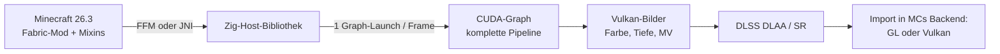
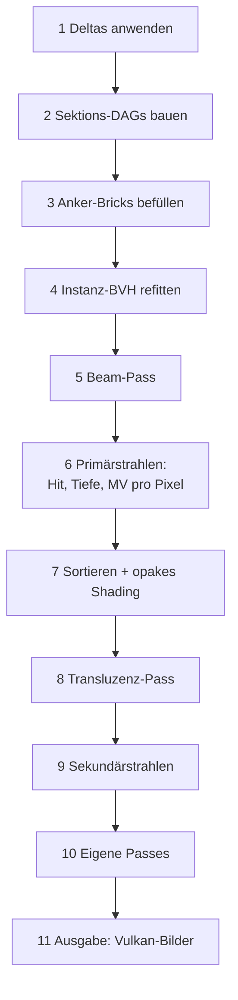

# Voxel-DAG-Renderer auf CUDA – Plan (Zig, Minecraft 26.3)

Stand: 21.09.2026

## Ziel und Rahmen

Ein Renderer auf dieser Runtime soll mit wenig Code hocheffizient sein, und exakte Motion Vectors entstehen automatisch – **pro Pixel**, auch innerhalb eines Blocks und auch für bewegte, verformte und texturanimierte Oberflächen. Geometrie besteht zur Laufzeit ausschließlich aus Sparse Voxel DAGs, ohne Vertices oder Meshes.

Festgelegte Rahmenbedingungen:

- **Vollständig GPU-getrieben:** Die CPU schreibt pro Frame nur Änderungsdaten in einen Ringpuffer und startet einen einzigen CUDA-Graphen. Keine Rückleseoperationen, keine Entscheidungen auf dem Host.
- **Zig** für Runtime, Kernel und Host-Bibliothek (Kernel über `-target nvptx64-cuda`).
- **Erster realer Renderer: Minecraft Java 26.3** als Mod. Die Spiellogik bleibt in Java; die Runtime ersetzt das Welt-Rendering.
- **Erweiterbarkeit:** Mit Mods soll praktisch alles möglich sein. Eigener CUDA-Code lässt sich über Hooks für Materialien, Verformungen, Voxel-Animationen, Texturfluss, Geometriequellen und eigene Passes einbauen.

Relevante Eigenschaften von Minecraft 26.x:

- Seit 26.1 ist Java 25 Pflicht. Damit steht die Foreign Function & Memory API (FFM) zur Verfügung.
- Seit 26.1 ist der Code nicht mehr obfuskiert, was Mixins und Wartung deutlich erleichtert.
- Seit 26.2 gibt es neben OpenGL einen experimentellen Vulkan-Renderer; Standard ist weiterhin OpenGL. Mojang plant den vollständigen Wechsel auf Vulkan. Die Runtime muss daher beide Backends bedienen.

## Architekturüberblick



Die Runtime besitzt ein eigenes Vulkan-Device, das alle geteilten Bilder und Semaphoren anlegt und exportiert. CUDA importiert sie über External Memory und External Semaphores. Minecraft bekommt das fertige Bild je nach aktivem Backend:

- **OpenGL:** Import über `GL_EXT_memory_object` und `GL_EXT_semaphore`.
- **Vulkan:** Import über `VK_KHR_external_memory` und `VK_KHR_external_semaphore` in Minecrafts eigenes Vulkan-Device.

Eingehängt wird auf der Ebene von Minecrafts eigener Render-Abstraktion, nicht über direkte GL- oder Vulkan-Aufrufe. So bleibt der Mod beim Backend-Wechsel stabil. GUI, Chat und Overlays zeichnet Minecraft weiterhin selbst über das importierte Bild.

## Brücke Java ↔ Zig

Da Minecraft 26.x auf Java 25 läuft, ist **FFM der empfohlene Weg**: Zig exportiert schlichte C-Funktionen, Java ruft sie über `Linker`/`MethodHandle` auf und greift auf den gepinnten Speicher als `MemorySegment` zu. Es entfällt jeglicher JNI-Glue-Code. JNI bleibt als gleichwertige Alternative möglich; an der Architektur ändert sich dadurch nur die dünne Aufrufschicht.

| Aufruf | Häufigkeit | Zweck |
| --- | --- | --- |
| `vr_init(config)` | einmal | GPU, Vulkan-Bilder, Graph anlegen; liefert die gepinnten Ringpuffer |
| `vr_import_backend(handles)` | bei Backend-Start | Bilder und Semaphoren in Minecrafts GL- oder Vulkan-Kontext importieren |
| `vr_reload_resources(models, atlas)` | bei Ressourcenpaket-Wechsel | Modelltabelle und Atlas hochladen, Modell-DAGs auf der GPU voxelisieren |
| `vr_register_hook(kind, id, source, params)` | beim Laden von Mods | eigenen CUDA-Code kompilieren und einbinden |
| `vr_render_frame(ring_offset)` | pro Frame | Graph starten |

Pro Frame gibt es genau einen Aufruf. Alle Massendaten schreibt Java direkt in den gepinnten Speicher; drei Ringpuffer-Segmente mit Frame-Fences verhindern, dass Java überschreibt, was die GPU noch liest.

```zig
export fn vr_render_frame(ring_offset: u64) void {
    // Ring-Offset in den Parameterpuffer schreiben, Graph starten – keine weitere Arbeit
}
```

## Was „vollständig GPU“ bedeutet

Die CPU tut pro Frame genau drei Dinge:

1. Java schreibt Änderungen (Chunk-Sektionen, Blockänderungen, Entity-Posen, Kamera) in den gepinnten Ringpuffer.
2. Ein Aufruf `vr_render_frame(ring_offset)`.
3. Die Zig-Bibliothek startet den vorinstanziierten CUDA-Graphen.

Alles andere läuft auf der GPU: Deltas anwenden, DAGs bauen, BVH refitten, Traversierung, Sortierung, Shading, Nachbearbeitung. Arbeitsmengen, die erst auf der GPU bekannt sind, werden über feste Grid-Größen mit Arbeitswarteschlangen oder über bedingte Graph-Knoten abgearbeitet, nie über einen Umweg zur CPU.

## Grundprinzip der Motion Vectors

Alles, was sich bewegt, ist eine reine Funktion von explizit deklariertem Zustand. Der Zustand liegt auf der GPU doppelt vor (aktuell und Vorframe); welcher Puffer „aktuell“ ist, bestimmt die Parität des Frame-Zählers. Die Runtime ruft dieselbe Funktion ein zweites Mal mit dem Vorframe-Zustand auf:

```
MV = proj(f(p, s_prev), cam_prev) − proj(f(p, s_cur), cam_cur)
```

Drei harte Regeln:

1. Positionen und Texturkoordinaten hängen nur von deklariertem Zustand und der Ruheposition ab – keine globalen Variablen, keine Zeitstempel außerhalb des Zustands.
2. Zufall nur mit Seed aus stabiler ID plus Zustand.
3. Jeder sichtbare Punkt kann jederzeit sagen, woher er kommt: seine Ruheposition in einem stabilen Bezugssystem.

Weder Zig noch CUDA C++ können diese Regeln im Compiler erzwingen. Deshalb sind zwei Dinge Pflicht: Hook-Signaturen, die nur `const`-Zustand übergeben, und der MV-Validator, der in jedem Debug-Build läuft.

**Stabile Slots:** Java vergibt jedem bewegten Objekt (Entity-Teil, Block-Entity, Partikel) einen Slot, der über seine Lebensdauer gleich bleibt. Der Zustand ist ein Array über Slots. Ein frisch belegter Slot hat keinen gültigen Vorframe-Eintrag und erzeugt automatisch das Neu-Flag.

## Motion Vectors pro Pixel

Motion Vectors pro Block reichen nicht: Innerhalb eines Blocks bewegen sich wehende Blätter, Fließtexturen und animierte Modellteile unterschiedlich. Die Runtime berechnet deshalb jeden Motion Vector aus dem **exakten, kontinuierlichen Trefferpunkt** des Pixels, nie aus Block- oder Voxelmittelpunkten. Drei Beiträge werden unterschieden.

### 1. Geometrische Bewegung am exakten Trefferpunkt

- Die Traversierung liefert den Trefferpunkt `x` auf der Voxelfläche als Gleitkommaposition, nicht den Voxelindex.
- Daraus wird die Ruheposition `p_rest` exakt zurückgerechnet: bei Rigid über die inverse Transformation, bei Warped über die Fixpunkt-Inversion, bei Anker-Bricks über den Anker plus den Versatz innerhalb des Voxels.
- `p_rest` wird mit dem Vorframe-Zustand vorwärts abgebildet.

Damit ist der Motion Vector stetig über die Fläche jedes Voxels. Es gibt keine Stufen im 1/16-Raster und keine Stufen an Blockgrenzen. Eine wehende Grasfläche erhält am Halmansatz einen anderen Vektor als an der Spitze, weil die Warp-Funktion an jedem Pixel einzeln ausgewertet wird.

### 2. Pro-Voxel-Animation (unstetige Bewegung)

Warp-Funktionen müssen stetig sein (Lipschitz L < 1). Viele Mod-Effekte sind das nicht: einzelne Voxel, die unabhängig springen, zerbröseln, aufklappen oder sich verschieben. Dafür gibt es die Klasse **Anker-Bricks**:

- Betroffene Blöcke werden pro Frame in dynamische 4×4×4-Bricks ausgelagert; ein Hook bestimmt für jedes Voxel seine aktuelle Position.
- Jedes Voxel speichert seinen Anker: Herkunftsbezug (Block, Voxelkoordinate bzw. Knochen) und die lokale Position.
- Der Motion Vector ergibt sich aus Anker + Versatz im Voxel, abgebildet mit dem Vorframe-Zustand – exakt pro Voxel und stetig innerhalb jeder Voxelfläche.

Dieselbe Klasse deckt auch weich deformierte Mod-Modelle (Skinning über SDF-Primitive an Knochen) ab.

### 3. Texturfluss (Bewegung auf der Oberfläche)

Fließtexturen bewegen Inhalt über ruhende Geometrie, etwa fließendes Wasser, Lava oder Förderbänder aus Mods. Rein geometrische Vektoren wären dort null, und DLSS würde verschmieren. Deshalb darf ein Material seine Texturkoordinate als reine Funktion deklarieren:

```
uv = g(p_rest, fläche, s)
```

Die Runtime sucht den Oberflächenpunkt `p'`, dessen Vorframe-Texturkoordinate der aktuellen entspricht: `g(p', s_prev) = g(p_rest, s_cur)`. Bei linearem Fluss ist das eine direkte Verschiebung, sonst ein Newton-Schritt mit der Jacobi-Matrix von g. Der Motion Vector ist dann `proj(f(p', s_prev)) − proj(f(p_rest, s_cur))`; er enthält also Geometrie und Texturfluss zusammen.

Pro Material wählbar:

| MV-Quelle | Einsatz |
| --- | --- |
| Geometrie | Standard für alle festen Oberflächen |
| Geometrie + Texturfluss | Wasser, Lava, Förderbänder, scrollende Mod-Texturen |
| Reactive | Flipbook-Animationen ohne stetige Bewegung (Feuer, Portale) |

Die Flussrichtung von Minecraft-Wasser pro Block liefert Java als Teil der Sektionsdaten; die Fließgeschwindigkeit ist ein Parameter der Wassertextur.

### Genauigkeit und Prüfung

- Motion Vectors werden in Pixeleinheiten als 16-Bit-Float pro Komponente gespeichert, ohne Jitter.
- Der MV-Validator verzerrt das Vorframe-Bild mit den Motion Vectors und zeigt die Differenz zum aktuellen Frame als Heatmap. Er misst zusätzlich den Fehler **innerhalb** von Blöcken mit eigenen Testszenen: wehendes Laub in Nahaufnahme, Fließwasser, Pro-Voxel-Animation, schnell drehende Entity-Teile.

## Bewegungsklassen

| Klasse | Minecraft-Inhalt | Geometriequelle | Ruheposition aus Trefferpunkt |
| --- | --- | --- | --- |
| Statisch | Blöcke der Welt | Sektions-DAGs | identisch; MV aus Kamera (+ ggf. Texturfluss) |
| Rigid | Entity-Modellteile, Block-Entities, Kolben, fallende Blöcke, Items, gehaltenes Item, Partikel | kleine DAG pro Teil + Transformation T(s) | T(s)⁻¹ · x |
| Warped | wehendes Laub und Gras, Wasseroberfläche, stetige Mod-Verformungen | Block-DAG + Verformung W(p, s) = p + d(p, s) | Fixpunkt-Inversion von W |
| Anker-Bricks | Pro-Voxel-Animationen aus Mods, weich deformierte Mod-Modelle | dynamische Bricks mit Anker pro Voxel | Anker + Versatz im Voxel |
| Neu entstanden | gesetzte/abgebaute Blöcke, gespawnte Entities | beliebig | keine – Flag für Reactive-/Disocclusion-Maske |

**Rigid:** Vanilla-Entities brauchen kein Skinning. Jeder Modellteil ist ein Quader mit Skin-Textur, der als eigene kleine DAG voxelisiert wird. Java liefert pro Frame die Pose jedes Teils. Zur Kamera ausgerichtete Partikel und Namensschilder bleiben korrekt, weil die Kamera Teil des Zustands ist.

**Warped:** Der Autor deklariert `max_displacement` (vergrößert die Schranke) und `lipschitz L < 1`. Mit L < 1 konvergiert die Fixpunkt-Inversion `p_{k+1} = x − d(p_k)` garantiert; mit dem Rest-Punkt des vorigen Marschschritts als Startwert reichen meist 1–2 Iterationen. Konservative Schrittweite: Ist der Rest-Punkt um r vom Rand des leeren DAG-Knotens entfernt, ist ein Weltschritt von `r · (1 − L)` sicher. Im Debug-Build prüft die Runtime L stichprobenartig über numerische Jacobi-Matrizen.

**Neu entstanden:** Voxel ohne Vorgeschichte bekommen ein Flag; die Runtime schreibt eine Reactive-/Disocclusion-Maske statt eines falschen Vektors.

## Weltdarstellung für Minecraft

**Sektionsgitter statt Riesenbaum:** Die geladene Welt ist ein Ringpuffer-Gitter von Sektionswurzeln (je 16×16×16 Blöcke) um den Spieler. Strahlen laufen per DDA durch das Gitter und steigen nur in belegte Sektionen ab.

**Zwei-Ebenen-DAG pro Sektion:**

- Die oberen Ebenen bilden die 16³ Blöcke der Sektion ab. Ihre Blattzeiger zeigen auf eine **Blockreferenz** (Zeiger auf Modell-DAG + Blockzustands-ID). Luft ist ein Nullzeiger.
- Darunter liegen die **Modell-DAGs**: jedes Blockmodell einmal mit 16³ Voxeln pro Block voxelisiert, passend zur Auflösung der 16×16-Texturen.

Alle Vollblöcke teilen sich eine einzige Würfel-DAG; nur die Zustands-ID unterscheidet sie. Die Sektionsebene wird per HashDAG dedupliziert. Ressourcenpakete mit höher aufgelösten Texturen bekommen entsprechend feinere Modell-DAGs (z. B. 32³).

**Texturen ohne Attributspeicher:** Farbe wird beim Treffer berechnet statt gespeichert:

1. Die DDA liefert die exakte Trefferfläche (Achse + Richtung) – zugleich die blockige Minecraft-Normale.
2. Das Modell-Element am Treffpunkt wird per Punkt-in-Quader-Test gegen die wenigen Elemente des Modells bestimmt (gedrehte Elemente über die inverse Rotation).
3. Aus (Zustands-ID, Element, Fläche) ergibt sich die Atlas-Region, aus dem Trefferpunkt die UV-Koordinate – bzw. bei Texturfluss aus `g(p_rest, fläche, s)`.
4. Animierte Texturen: Der Frame-Index liegt im Zustand. Biome-Tönung: ein kleines Biom-Farbgitter pro Sektion, das Java mitliefert.

**LOD und Sichtweite:** Jenseits der Render-Distanz behält die GPU die groben DAG-Ebenen bereits gesehener Sektionen. Grobe Ebenen bekommen vorgefilterte Farben pro innerem Knoten, die beim Sektionsbau auf der GPU entstehen.

**Allgemeiner Inhalt außerhalb von Minecraft:** Der generische Weg bleibt bestehen: DAG-Knoten mit Voxelanzahl, linearer Attribut-Index nach Dado et al. 2016, separat komprimierte Attribute.

## Datenstrukturen

| Struktur | Inhalt | Anmerkung |
| --- | --- | --- |
| Sektionsgitter | Ringpuffer von Sektionswurzeln um die Kamera | DDA-Einstieg für alle Strahlen |
| Sektions-DAG-Knoten | 8-Bit-Kindmaske + kompakte Kindzeiger | per GPU-Hashtabelle dedupliziert (HashDAG) |
| Blockreferenz | Zeiger auf Modell-DAG + Blockzustands-ID | Blatt der Sektionsebene |
| Modell-DAG | 16³ Voxel pro Blockmodell, Blätter als 4×4×4-Brick (64-Bit-Maske) | beim Ressourcen-Laden auf der GPU gebaut |
| Modelltabelle | Elemente (Quader, Rotation, Flächentexturen), Material, MV-Quelle | für Punkt-in-Quader-Test, Atlas-Lookup, Texturfluss |
| Texturatlas | Minecraft-Atlas als CUDA-Textur | inkl. Animationsframes |
| Anker-Brick-Pool | dynamische Bricks mit Anker pro Voxel | pro Frame neu befüllt |
| Instanz | Bewegungsklasse, DAG- oder Brick-Zeiger, Slot, Schranke | Grundlage der Instanz-BVH |
| Zustand | Kamera, Zeit, Slot-Transformationen, Animationsframes, Hook-Parameter – je aktuell und Vorframe | Paritäts-Index statt Kopie |
| Hit-Record | Tiefe, Instanz- bzw. Blockreferenz, Fläche, Flags | ca. 16 Byte pro Pixel |

**Instanzebene:** Eine eigene BVH über die Instanzen, in Zig als Kernel gebaut und refittet. OptiX entfällt als Hauptpfad, weil dessen Device-Programme aus Zig nicht offiziell unterstützt sind.

Der Motion Vector wird im Epilog des Traversal-Kernels berechnet, wo Trefferpunkt und Ruheposition ohnehin im Register liegen.

## Frame-Pipeline (ein CUDA-Graph)



1. **Deltas anwenden:** Ein Kernel liest den Ringpuffer: neue und entladene Sektionen, Blockänderungen, Wasser-Flussrichtungen, Slot-Transformationen, Kamera. Der Zustand wird in den aktuellen Puffer geschrieben; der Paritäts-Index kippt.
2. **Sektions-DAGs bauen:** Neue Sektionen und geänderte Blöcke per HashDAG-Insert; betroffene Blöcke bekommen das Neu-Flag.
3. **Anker-Bricks befüllen:** Pro-Voxel-Animations-Hooks und weich deformierte Modelle schreiben ihre Voxel samt Anker in den Brick-Pool.
4. **Instanz-BVH refitten**, bei geänderter Instanzanzahl neu bauen – beides auf der GPU.
5. **Beam-Pass** mit 1/8 Auflösung liefert pro 8×8-Kachel eine konservative Mindesttiefe.
6. **Primärstrahlen:** DDA durchs Sektionsgitter, ESVO-artige Traversierung (Laine & Karras 2010), parallel dazu die Instanz-BVH. Der Epilog berechnet aus dem exakten Trefferpunkt Ruheposition, geometrische Bewegung und – falls das Material es verlangt – Texturfluss, und schreibt Hit-Record, Tiefe und Motion Vector.
7. **Opakes Shading:** Radix-Sortierung der Treffer nach Material, dann ein einziger Shading-Kernel mit `switch` über Materialien (inkl. Material-Hooks).
8. **Transluzenz-Pass** für Wasser, Glas, Eis ab der opaken Tiefe. Für die Wasseroberfläche wird ein eigener Motion Vector (Geometrie + Texturfluss) berechnet; die Maske legt fest, ob DLSS diesen oder den des Untergrunds verwendet.
9. **Sekundärstrahlen** für Schatten und GI über dieselbe Traversierung, bei gröberem LOD. Minecrafts Lichtwerte dienen als günstige Basis bzw. Fallback.
10. **Eigene Passes** (Hooks) als zusätzliche Graph-Knoten mit deklarierten Ein- und Ausgabepuffern.
11. **Ausgabe:** Farbe, Tiefe, Motion Vectors und Reactive-Maske in die Vulkan-Bilder, Semaphore signalisieren. Danach DLSS (DLAA bzw. Super Resolution) und der Import in Minecrafts aktives Backend.

## Integration in Minecraft 26.3

**Mod-Seite:** Ein Fabric-Mod ersetzt per Mixins das Welt-Rendering und greift die Datenquellen ab: Chunk-Sektionen beim Laden, Blockänderungen, Fluidzustände, Entity-Posen aus dem Modell-Rendering, gebackene Blockmodelle und den Atlas beim Ressourcen-Neuladen. Dank des unobfuskierten Codes sind die Einhängepunkte lesbar benannt.

**Backend-Erkennung:** Beim Start stellt der Mod fest, ob Minecraft mit OpenGL oder dem experimentellen Vulkan-Renderer läuft, und importiert die geteilten Bilder entsprechend (`vr_import_backend`). Beide Wege werden von Anfang an getestet.

**Kompatibilität mit Mods, die eigene Meshes zeichnen:** Geometrie, die (noch) nicht konvertiert wird, zeichnet Minecraft nach dem Voxel-Pass mit Tiefentest gegen die Voxel-Tiefe. Diese Pixel bekommen keine exakten Motion Vectors und werden in der Reactive-Maske markiert. Langfristig können Mods ihre Geometrie über Geometrie- oder Anker-Brick-Hooks direkt liefern.

## Eigener CUDA-Code (Hooks)

| Hook | Wird aufgerufen in | Signatur (vereinfacht) | Pflichtangaben |
| --- | --- | --- | --- |
| Material | Shading (Schritt 7) | `float4 f(const HitInfo*, const FrameState*, const void* params)` | MV-Quelle |
| Texturfluss | MV-Epilog (Schritt 6/8) | `float2 uv(float3 p_rest, int face, const FrameState*, const void* params)` | – |
| Warp | Traversierung (Schritt 6), pro Marschschritt | `float3 f(float3 p_rest, const FrameState*, const void* params)` | `max_displacement`, `lipschitz` |
| Voxel-Animation | Anker-Bricks (Schritt 3) | `bool f(int3 voxel, const FrameState*, const void* params, float3* pos_out)` | Schranke |
| Geometriequelle | Sektionsbau / Voxelisierung | `float f_sdf(float3 p, const void* params)` | Schranke |
| Pass | eigener Graph-Knoten (Schritt 10) | ganzer Kernel | gelesene und geschriebene Puffer |

Beispiel eines Warp-Hooks in CUDA C++:

```cpp
extern "C" __device__ float3 mymod_sway(float3 p, const FrameState* s, const void* params) {
    float a = 0.05f * sinf(s->time * 1.7f + p.x * 0.3f) * p.y;   // nur p und Zustand
    return make_float3(p.x + a, p.y, p.z);
}
```

Beispiel eines Texturfluss-Hooks:

```cpp
extern "C" __device__ float2 mymod_conveyor_uv(float3 p, int face, const FrameState* s, const void* params) {
    const float speed = *(const float*)params;                 // Texel pro Sekunde
    return make_float2(p.x * 16.0f + s->time * speed, p.z * 16.0f);
}
```

Registrierung aus einem Mod:

```java
VoxelRenderer.registerWarp("mymod:sway", source, 0.1f /* max_displacement */, 0.3f /* lipschitz */);
VoxelRenderer.assignWarp(Blocks.TALL_GRASS, "mymod:sway");
VoxelRenderer.registerUvFlow("mymod:conveyor", source, params);
```

**Kompilier- und Link-Weg:** Hooks in CUDA C++ werden zur Laufzeit per NVRTC übersetzt und per nvJitLink mit den Runtime-Kerneln verbunden; danach wird der Graph neu instanziiert. Hooks in Zig werden als PTX mitgeliefert und genauso gelinkt.

**Offener technischer Punkt – Inlining:** Die Runtime-Kernel entstehen aus Zig als PTX. Beim Linken von PTX werden Hooks zu echten Funktionsaufrufen; nur LTOIR erlaubt Inlining über Modulgrenzen. Für Material-Hooks ist ein Aufruf vertretbar, für Warp-Hooks im inneren Marschloop womöglich nicht. Zwei Wege werden in M0 getestet:

- Zig erzeugt LLVM-Bitcode, libNVVM macht daraus LTOIR (Risiko: libNVVM erwartet eine bestimmte LLVM-IR-Version).
- Fallback: Die Traversierungsschleife mit Warp-Hooks wird pro registrierter Hook-Menge als CUDA C++ generiert und per NVRTC übersetzt; alle anderen Kernel bleiben in Zig.

**MV-Verträge für fremden Code:** Hooks bekommen nur `const`-Zeiger. Die Einhaltung der Reinheitsregeln und der Lipschitz-Angabe prüft der Debug-Build automatisch. Ein Hook, der den Validator verletzt, wird im Log mit Namen gemeldet.

## Toolchain

- **Zig** für Host-Bibliothek (C-ABI-Exporte für FFM bzw. JNI, Graph-Aufbau, Interop) und Kernel (`-target nvptx64-cuda`).
- **C-APIs per `@cImport`:** CUDA-Driver-API (`cuda.h`), NVRTC, nvJitLink, Vulkan, OpenGL-Extension-Header, ggf. JNI.
- **Eigene GPU-Grundbausteine in Zig:** Scan, Radix-Sort, Stream-Compaction, GPU-Hashtabelle. Alternativ werden einzelne CUB-Kernel einmalig mit nvcc zu PTX übersetzt und mitgeliefert.
- **Plattformen:** Zig cross-compiliert die Bibliothek für Linux und Windows. DLSS läuft unter Linux über den eigenen Vulkan-Layer, unter Windows direkt über NGX.
- **Notfallpfad:** Ist der Traversal-Kernel in Zig im Benchmark deutlich langsamer als in CUDA C++, wird nur dieser Kernel in C++ geschrieben und als PTX eingebunden.

## Meilensteine

| # | Inhalt | Abnahmekriterium |
| --- | --- | --- |
| M0 | Spikes: Zig-Kernel per FFM aus Minecraft 26.3 gestartet; Vulkan-Bild in CUDA beschrieben und in **beiden** MC-Backends (GL, Vulkan) angezeigt; Hook per NVRTC + nvJitLink gelinkt; LTOIR-Weg aus Zig getestet | Testbild erscheint in beiden Backends; Aufrufkosten eines gelinkten Hooks gemessen; Entscheidung LTOIR vs. generierte Traversierung |
| M1 | Statische Welt: Sektions-Upload, Modell-Voxelisierung auf der GPU, Sektions-DAGs, Primärstrahlen, Atlas-Texturierung, Beam-Pass | Vanilla-Welt texturgetreu bei Standard-Sichtweite; Mrays/s gemessen; Zig vs. CUDA C++ im Traversal-Kernel verglichen |
| M2 | LOD für große Sichtweiten, vorgefilterte Knotenfarben, Material-Sortierung + Shading, animierte Texturen, Biome-Tönung | kein sichtbares Flimmern in der Ferne (mit DLAA); Sichtweite deutlich über Vanilla bei gleicher Framezeit |
| M3 | Bewegung: Kamera, Entities, Block-Entities, Items, Partikel; Slots; MV pro Pixel aus exaktem Trefferpunkt; MV-Validator mit Testszenen innerhalb von Blöcken; DLAA/SR | Validator-Heatmap außerhalb von Disocclusion-Kanten leer; keine Stufen im 1/16-Raster in der MV-Ansicht |
| M4 | Dynamik: Blockänderungen per HashDAG, Kolben und fallende Blöcke als Instanzen, Neu-Flag | Abbauen/Setzen ohne Artefakte; Neu-Flag korrekt in der Reactive-Maske |
| M5 | Warped (Laub, Gras, Wasseroberfläche); Texturfluss (Wasser, Lava); Transluzenz (Wasser, Glas, Eis) | Validator sauber bei Wind in Nahaufnahme; fließendes Wasser ohne Schlieren unter DLSS |
| M6 | Anker-Bricks: Pro-Voxel-Animation und weich deformierte Modelle | Validator sauber bei unabhängig bewegten Voxeln; Befüllzeit pro Objekt gemessen |
| M7 | Öffentliche Hook-API (alle sechs Hook-Arten), Registrierung aus Java, Beispiel-Mods | Beispiel-Mods laufen ohne Änderungen an der Runtime; fehlerhafter Hook wird vom Validator benannt |
| M8 | Beleuchtung: RT-Schatten, GI, emissive Blöcke; Minecraft-Licht als Fallback | Kosten pro Strahltyp gemessen |
| M9 | Frame Generation mit eigener Präsentationssteuerung | Frame-Pacing gemessen |

## Risiken

| Risiko | Auswirkung | Gegenmaßnahme |
| --- | --- | --- |
| Inlining von Hooks aus Zig-PTX | Warp- und Texturfluss-Hooks im heißen Pfad werden teuer | Test in M0; Fallback: Traversierung mit Hooks per NVRTC generieren |
| Minecrafts Backend im Umbau (GL Standard, Vulkan experimentell) | Einhängepunkte und Import-Weg ändern sich | Einhängen über Minecrafts Render-Abstraktion; beide Backends ab M0 testen |
| Texturfluss bei nicht-linearen UV-Funktionen | Newton-Schritt ungenau, MV-Fehler auf der Fläche | Validator-Testszenen; Rückfall auf Reactive-Markierung, wenn der Restfehler eine Schwelle überschreitet |
| Kosten der Anker-Bricks | viele animierte Blöcke sprengen das Frame-Budget | Messung in M6; Anker-Bricks nur für tatsächlich animierte Blöcke |
| Mods mit eigenen Meshes | nicht voxelisiert, keine exakten MV | Zeichnen mit Tiefentest + Reactive-Maske; später Geometrie-Hooks |
| Entity-Überlagerungen (Hut-, Rüstungsschicht um 0,5 Texel vergrößert) | nicht exakt im 1/16-Gitter darstellbar | Entity-Teile mit 1/32-Auflösung voxelisieren |
| Frame Generation | Minecraft kontrolliert Swapchain und Pacing | FG erst in M9, zunächst DLAA/SR |
| Junge Zig-Toolchain (Sprache vor 1.0, NVPTX-Nutzung selten) | Compiler-Bugs, Sprachänderungen | Zig-Version pinnen; Notfallpfad C++ für den heißesten Kernel |
| Fehlende CUB-Äquivalente in Zig | Mehraufwand für Sortierung und Scan | Grundbausteine früh (M1) bauen oder als PTX aus CUB einbinden |
| Reinheit von Hook-Code nicht erzwingbar | fehlerhafte Motion Vectors durch fremden Code | `const`-Signaturen, Validator im Debug-Build, Hook-Name im Fehlerbericht |
| NVIDIA-Bindung | viele Minecraft-Spieler ohne NVIDIA-GPU | bewusst akzeptiert; Vanilla-Renderer bleibt als Rückfall |

## Referenzen

- Kämpe, Sintorn, Assarsson 2013 – High Resolution Sparse Voxel DAGs
- Laine, Karras 2010 – Efficient Sparse Voxel Octrees
- Dado et al. 2016 – Geometry and Attribute Compression for Voxel Scenes
- Careil, Billeter, Eisemann 2020 – Interactively Modifying Compressed Sparse Voxel Representations (HashDAG)
